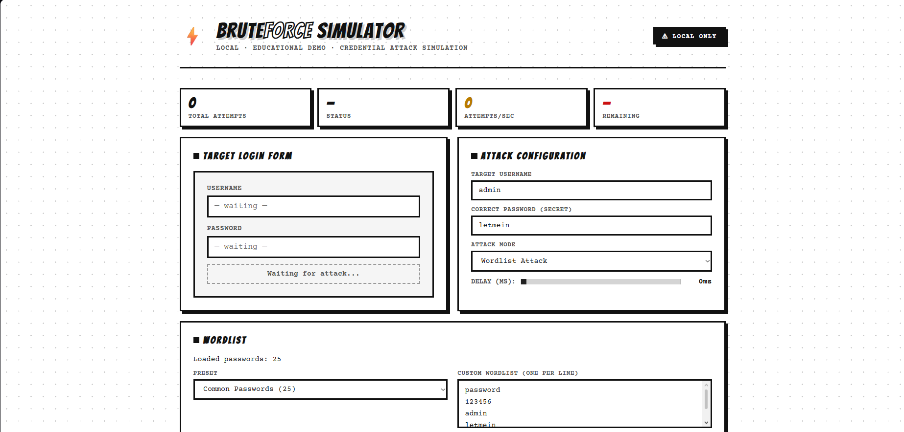
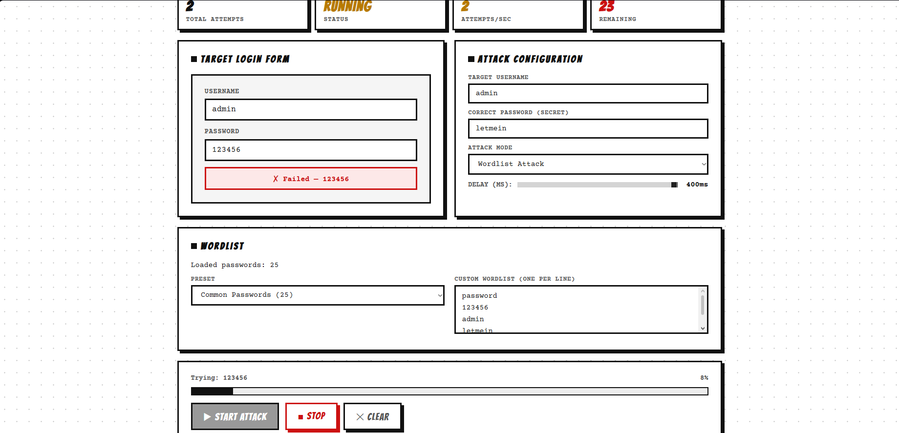
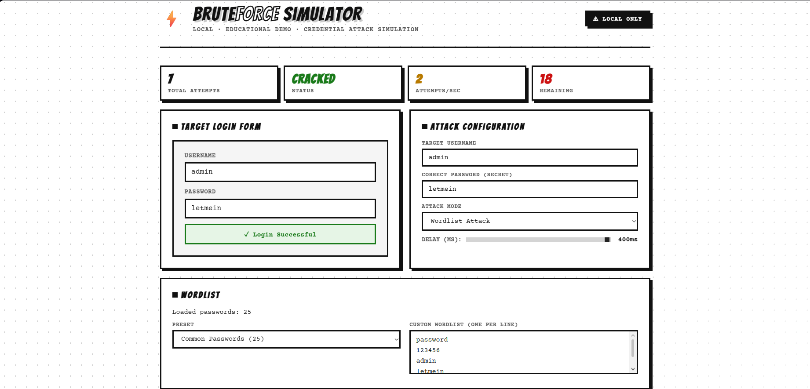

# Brute Force Attack Simulator

A React-based cybersecurity education tool that demonstrates how brute force and dictionary attacks work in a safe, browser-only environment.

Built for cybersecurity learning, attack visualization, password security awareness, and ethical hacking demonstrations.

## Features

* Custom Wordlist Attacks
* Common Password Presets
* RockYou-Style Password Lists
* Sequential Brute Force Attack Mode
* Uppercase Characters (A-Z)
* Lowercase Characters (a-z)
* Numbers (0-9)
* Special Character Support
* Real-Time Attack Logging
* Live Progress Tracking
* Attempts Per Second Counter
* Remaining Attempts Indicator
* Credential Discovery Visualization
* Adjustable Attack Speed
* Wordlist Size Counter
* Browser-Based Execution
* No External Network Activity

## Overview

The Brute Force Attack Simulator demonstrates how password-cracking attacks operate against login systems.

Users can configure a target username and password, select an attack method, and observe how different password-guessing techniques work in real time.

The simulator runs entirely inside the browser and does not perform any real attacks, network requests, or unauthorized access attempts.

## Attack Modes

### Wordlist Attack

Attempts passwords from:

* Common Password List
* RockYou-Style Password List
* Fully Custom User Wordlists

### Sequential Brute Force

Generates passwords sequentially using:

A-Z
a-z
0-9
!@#$%^&*()-_=+[]{}|;:',.<>/?`~

The generator systematically explores combinations without skipping values.

## Learning Objectives

This project demonstrates:

* Brute Force Attacks
* Dictionary Attacks
* Password Security Concepts
* Authentication Weaknesses
* Attack Automation
* Credential Guessing Techniques
* Importance of Strong Passwords
* Cybersecurity Awareness

## Technologies Used

* React.js
* JavaScript (ES6+)
* HTML5
* CSS3

## Installation

Clone the repository:
git clone https://github.com/YOUR_USERNAME/brute-force-attack-simulator.git

Navigate into the project:
cd brute-force-attack-simulator

Install dependencies:
npm install

Run the application:
npm run dev
or
npm start

depending on your React setup.

## Screenshots

### Dashboard

### Wordlist Attack

### Credentials Found

## Example Demonstrations

* Cracking weak passwords using common password lists
* Comparing wordlist attacks against brute-force attacks
* Visualizing password attack speed
* Demonstrating why strong passwords matter
* Showing how attackers automate credential guessing

## Disclaimer

⚠ Educational Use Only

This project was created for cybersecurity education and awareness.

No real authentication systems, servers, websites, or networks are attacked. All attack simulations occur entirely within the browser using locally generated data.

This tool is intended solely for learning and demonstration purposes.

## Author

Charuka Weerasinghe

Cybersecurity Student | Information Security Enthusiast

## Future Improvements

* Password Strength Estimation
* Character Set Selection
* Attack Time Estimation
* CSV Wordlist Import
* Exportable Attack Reports
* Multi-Target Simulation
* Hash Cracking Demonstrations

## License

This project is licensed under the MIT License.
